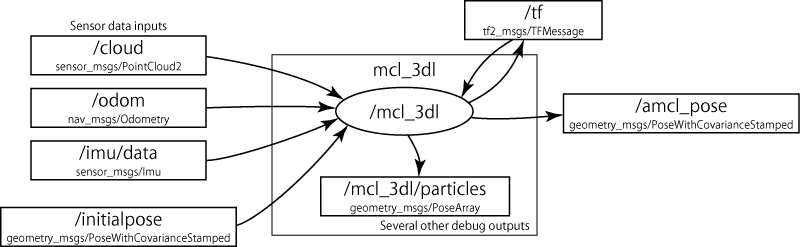

# mcl_3dl


[](https://codecov.io/gh/at-wat/mcl_3dl)
[](https://opensource.org/licenses/BSD-3-Clause)

## Package summary

*mcl_3dl* is a ROS node to perform a probabilistic 3-D/6-DOF localization system for mobile robots with 3-D LIDAR(s).
It implements pointcloud based Monte Carlo localization that uses a reference pointcloud as a map.

The node receives the reference pointcloud as an environment map and localizes 6-DOF (x, y, z, yaw, pitch, roll) pose of measured pointclouds assisted by a motion prediction using odometry.

Currently, the supported motion model is differential-wheeled-robot.
The node provides classic MCL; currently, it doesn't implement adaptive feature like KDL-sampling and etc.

## Algorithms

A fundamental algorithm of *mcl_3dl* node is Monte Carlo localization (MCL), aka particle filter localization.
MCL represents a probabilistic distribution of estimated pose as density and weight of particles and estimates the pose from the distribution.

- [Algorithm details](doc/Algorithms.md)
- [Parameters](doc/Parameters.md)

## Node I/O



## Install

### from source

**Note: mcl_3dl_msgs package is required to build mcl_3dl package.**

```shell
# clone
cd /path/to/your/catkin_ws/src
git clone https://github.com/at-wat/mcl_3dl.git
git clone https://github.com/at-wat/mcl_3dl_msgs.git

# build
cd /path/to/your/catkin_ws
rosdep install --from-paths src --ignore-src -y  # Install dependencies
catkin_make -DCMAKE_BUILD_TYPE=Release  # Release build is recommended
```

### from apt repository (for ROS Indigo/Kinetic/Lunar on Ubuntu)

```
sudo apt-get install ros-${ROS_DISTRO}-mcl-3dl
```

## Running the demo

The example bag file of 2+4-DOF tracked vehicle with two Hokuyo YVT-X002 3-D LIDAR is available online.
Pre-processed (filtered) 3-D pointcloud, IMU pose, odometry, and map data are packed in the bag.

```shell
# Download the example bag (230M)
wget -P ~/Downloads https://openspur.org/~atsushi.w/dataset/mcl_3dl/short_test3.bag

# Running the demo
roslaunch mcl_3dl test.launch use_pointcloud_map:=false use_cad_map:=false \
  use_bag_file:=true bag_file:=${HOME}/Downloads/short_test3.bag
```

The map data in the bag was generated by using the [cartographer_ros](https://github.com/googlecartographer/cartographer_ros) and filtered by using pcl_outlier_removal and pcl_voxel_grid utilities.


MarkerArray shows several *mcl_3dl* internal information.
- Purple spheres: sampled points used in the likelihood-model calculation
- Red lines: casted rays in the beam-model calculation
- Red boxes: detected collisions in raycasting

To try global localization, call `/global_localization` by the following command.

```shell
rosservice call /global_localization
```

[Demos without odometry and without IMU](doc/ExperimentalDemos.md) are also available.

## Contributing

*mcl_3dl package* is developed under [GitHub flow](https://guides.github.com/introduction/flow/).
Feel free to open new Issue and/or Pull Request.

The code in this repository is following [ROS C++ Style Guide](https://wiki.ros.org/CppStyleGuide).
A configuration file for clang-format is available at https://github.com/seqsense/ros_style/.

## License

- *mcl_3dl* is [provided under the BSD license](LICENSE).
- [Backport codes](include/pcl18_backports) of Point Cloud Library (PCL) is [provided under the BSD license](LICENSE.pcl-backports).
