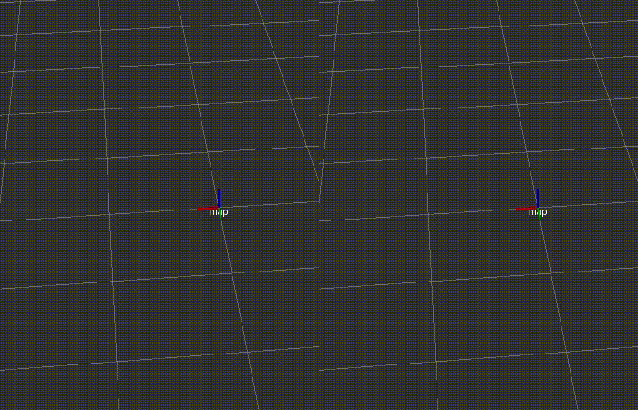

## Algorithms

A fundamental algorithm of *mcl_3dl* node is Monte Carlo localization (MCL), aka particle filter localization.
MCL represents a probabilistic distribution of estimated pose as density and weight of particles and estimates the pose from the distribution.

### Measurement

#### LIDAR measurement model

In general, *beam_range_finder_model* can reduce false positive matching of the measured point in the map, but is heavier than *likelihood_field_range_finder_model*.
(These models are well-described in the book Probabilistic Robotics, by Thrun, Burgard, and Fox.)

*mcl_3dl* node uses both *beam_range_finder_model* and *likelihood_field_range_finder_model* to perform good matching result with light computation power.
The node calculates a likelihood of each particle by multiplying a likelihood of *likelihood_field_range_finder_model*, by using a larger number of randomly sampled points, and a likelihood of *beam_range_finder_model*, by using only a few randomly sampled points.
It realizes pointcloud matching with small computation power with rejecting matched-but-wrong matches.

In this implementation, the likelihood of *likelihood_field_range_finder_model* is a summation of distances from each measured point to closest point in the map. 
The closest point search uses chunked Kd-tree, and the measured point is voxel filtered and random sampled to reduce computation power.

Likelihood of *beam_range_finder_model* is calculated by ray casting.
Where `N` is the number of rays of measured point, `n` is the number of the rays which passes through objects described in the map, and *alpha* is a rejection weight, the likelihood is given as `alpha^(n/N)`.

#### Axis dependent distance weight

In some environments like a floor with a sparse wall, e.g., temporary scaffolds with guard rails, distance in Z-direction must be less cared, since the number of points which can fix estimated Z position is relatively large.
In *mcl_3dl* node, the weight coefficient of distance calculation is changed by parameters.
For example in a scaffold based plant, `(dist_weight_x, dist_weight_y, dist_weight_z)=(1.0, 1.0, 5.0)` seems reasonable.

#### Acceleration measurement model

A likelihood of the vehicle posture is calculated by taking a difference between the acceleration vector in IMU data and particle pose.

### Prediction

The pose of the particles is predicted according to odometry data with noise parameters.
Using odometry data compensated by IMU is recommended.

### Resampling

*mcl_3dl* node resamples particles by copying particles which have large probability according to the distribution.
Copied particles are spread by the Gaussian noise.

### Expansion resetting

*mcl_3dl* has an ad-hoc implementation of the expansion resetting method.
(More theoretical method and its implementation were proposed in [[Ueda 2004]](https://ieeexplore.ieee.org/document/1389781/).)

The node spreads particle distribution by given Gaussian noise if the ratio of the measured points which have corresponding map points is smaller than the threshold.
By using the expansion resetting, the particle distribution can recover the true pose even if there are local minimum solutions, as shown on the right side of the figure below.

